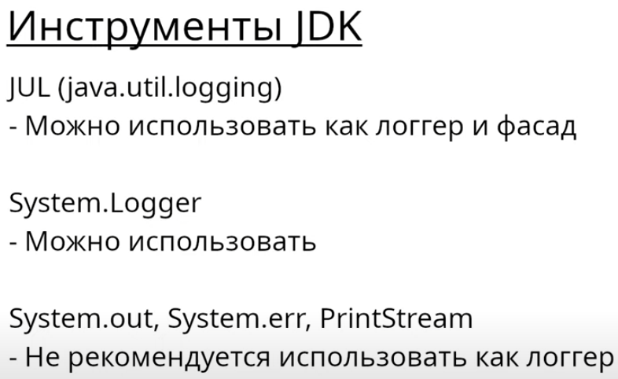
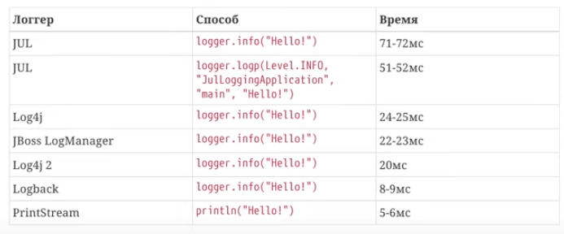

# Средства логирования

# Инструменты логирования JDK

## Скорость записи 1000 сообщений в лог
Взято из этого видео [Инструменты логгирования для платформы Java](https://www.youtube.com/watch?v=WsyZf7w7m7o&t=281s&ab_channel=%D0%A3%D0%B3%D0%BE%D0%BB%D0%BE%D0%BA%D1%81%D0%B5%D0%BB%D1%8C%D1%81%D0%BA%D0%BE%D0%B3%D0%BE%D0%B4%D0%B6%D0%B0%D0%B2%D0%B8%D1%81%D1%82%D0%B0)
 JUL тут используется напрямую, не как фасад!
