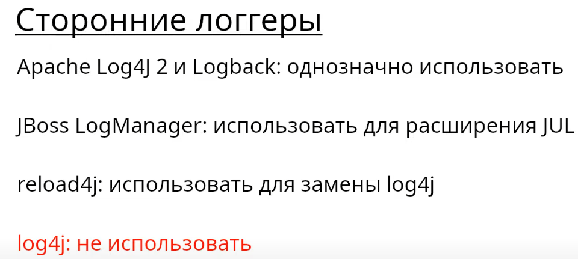
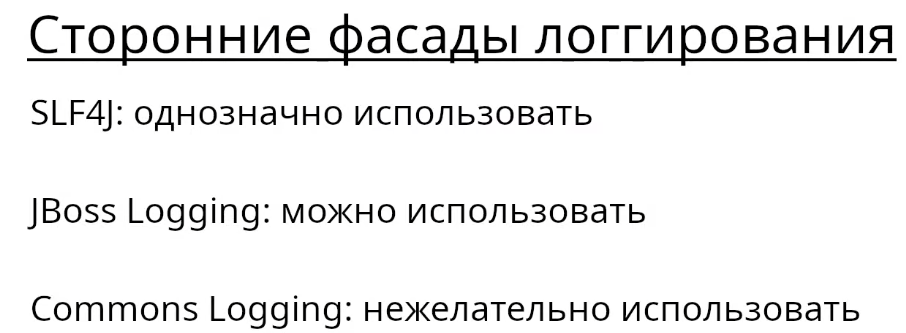
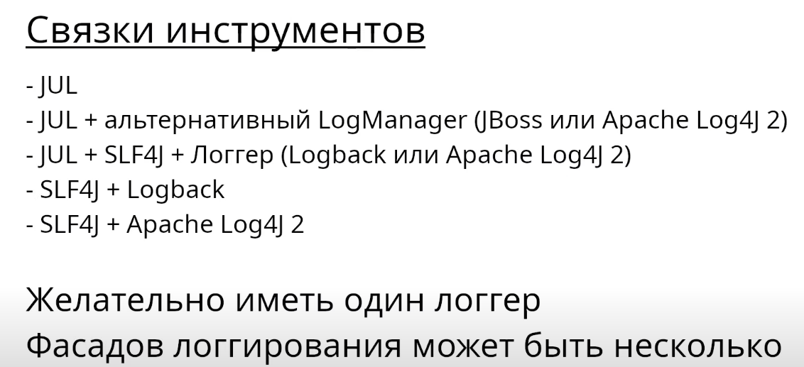

# Средства логирования

# Инструменты логирования JDK

## Скорость записи 1000 сообщений в лог
Взято из этого видео [Инструменты логгирования для платформы Java](https://www.youtube.com/watch?v=WsyZf7w7m7o&t=281s&ab_channel=%D0%A3%D0%B3%D0%BE%D0%BB%D0%BE%D0%BA%D1%81%D0%B5%D0%BB%D1%8C%D1%81%D0%BA%D0%BE%D0%B3%D0%BE%D0%B4%D0%B6%D0%B0%D0%B2%D0%B8%D1%81%D1%82%D0%B0)
 JUL тут используется напрямую, не как фасад!

# Резюме по сторонним логерам

# Резюме по сторонним фасадам логирования
Если в качестве фасада логирования нас не устраивает JUL или SystemLogger то картинка ниже

# Касательно построения системы логирования в приложении
 - Использовать фасад логирования чтобы не привязываться к конкретному логеру и легко ее заменить
 - Для минимальной реализации хватит и JUL (java util logging) так как он может быть и логером и фасадом
 - Хорошие связки, SLF4j + LOG4j2 + адаптер, SLF4j + LOGBACK
 - Желательно в проекте использовать 1 реализацию логера, что бы все фасады всех компонентов системы использовали 1 логер,
 что бы мы могли централизованно управлять логированием
 - В проекте может быть несколько фасадов логирования (не страшно)
 - Хорошо когда логи пишутся в файл на сервере где работает приложение а сторонние сборшики логов их от туда забирают,
 что бы логи точно не потерялись. Запись лога на диск надежнее передачи лога по сети!

 - Хороший пример использования логирования это Spring Security