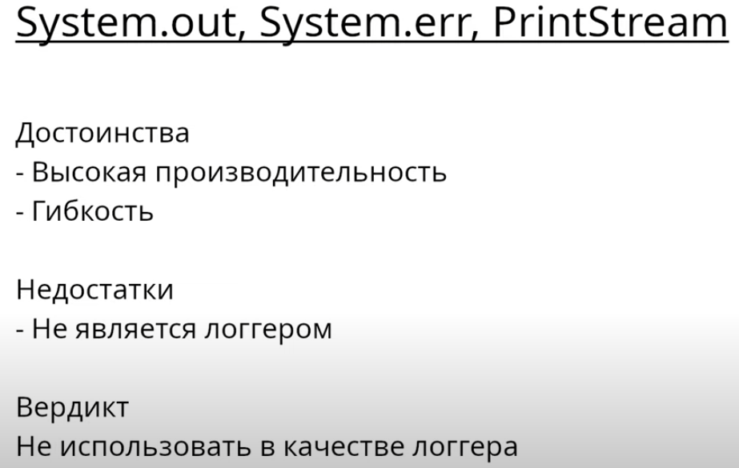
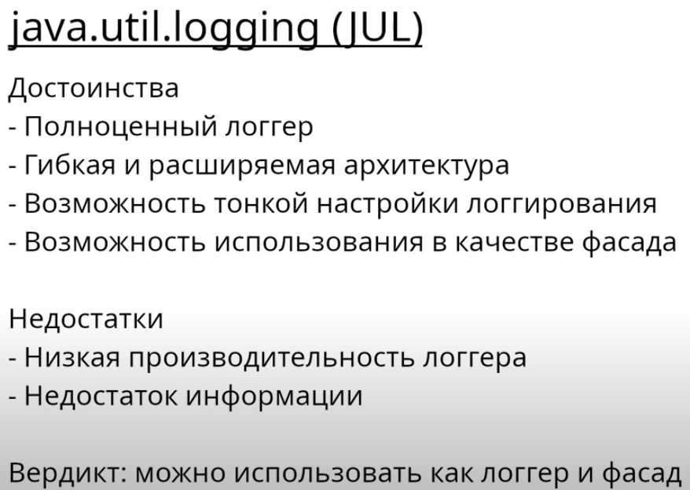
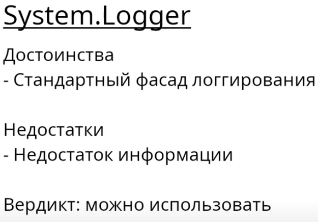
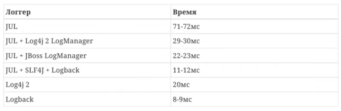

# Стандартные средства логирования JDK
Проект сделан на основе видео [Инструменты логгирования для платформы Java](https://www.youtube.com/watch?v=WsyZf7w7m7o&t=281s&ab_channel=%D0%A3%D0%B3%D0%BE%D0%BB%D0%BE%D0%BA%D1%81%D0%B5%D0%BB%D1%8C%D1%81%D0%BA%D0%BE%D0%B3%D0%BE%D0%B4%D0%B6%D0%B0%D0%B2%D0%B8%D1%81%D1%82%D0%B0)

## System.otu, System.err, PrintStream

## JUL

## System.Logger

## JUL в качестве фасада для другого логера

Как видно из таблицы работа JUL в качестве фасада для логера приближается к работе самого логера

## Итог по логерам из JDK
JUL и System.Logger подходят для соблюдения принципов чистого кода (чтоб в коде классов не было внешних зависимостей).
  System.out, System.err в качестве логеров использовать не стоит так как они для этого не предназначены, и придется
самому учесть множество нюансов логирования.